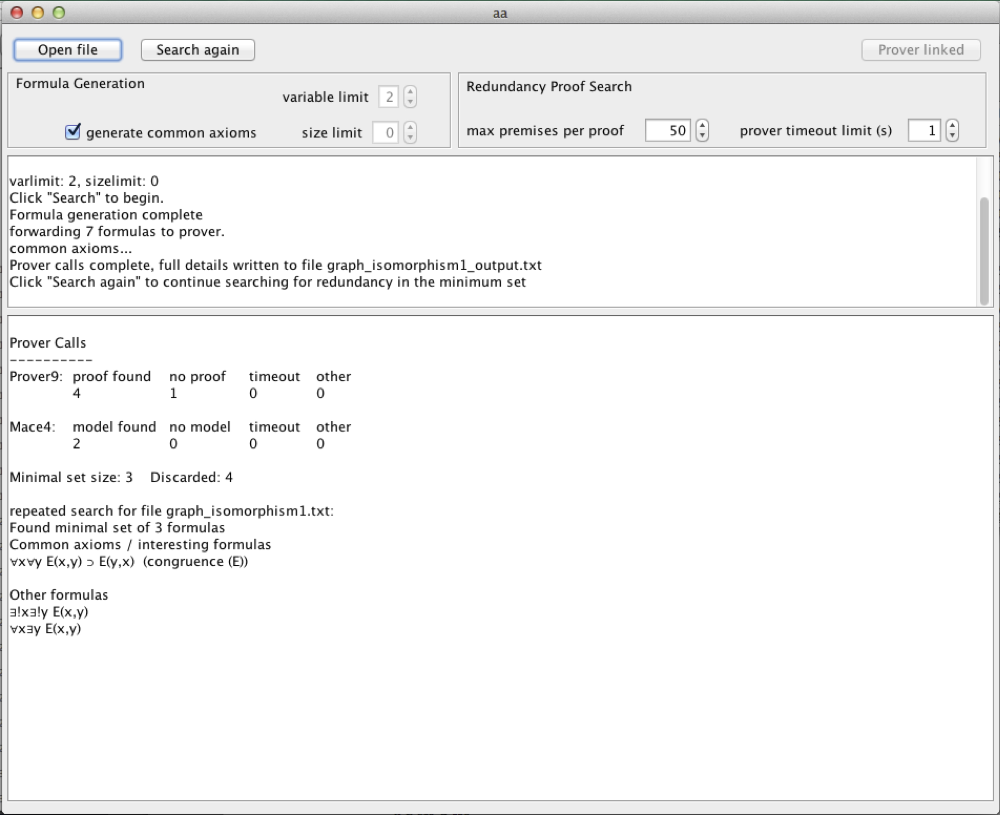

README.md

 # aa 

 A Java app that does brute-force search for axioms for finite mathematical domains. Written for macOS, mileage on Linux systems may vary.
 
 

 Developed in collaboration with [Dirk Schlimm](https://www.cs.mcgill.ca/~dirk/) at McGill, originally as a small command line C++ project expanding on an example in his paper ["Two Ways of Analogy: Extending the Study of Analogies to Mathematical Domains"](https://www.journals.uchicago.edu/doi/10.1086/590198). This is a much-expanded version written in Java, with a simple GUI interface. I presented the results of our work together at the 41st Annual Meeting of the Cognitive Science Society ([COGSCI '19](https://cogsci.mindmodeling.org/2019/papers/0607/0607.pdf)).

 Includes full documentation in javadoc format, as well as an explantory appendix with instructions for use. Requires an install of Prover9/Mace4: https://www.cs.unm.edu/~mccune/mace4/download.